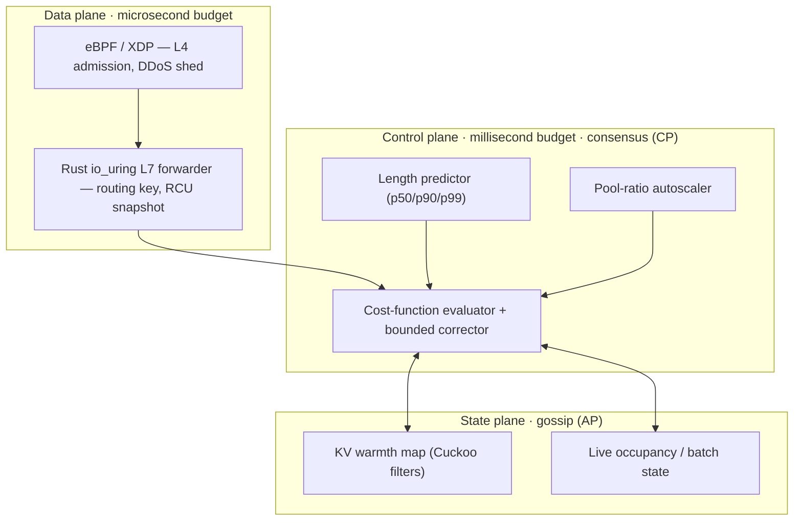

<div align="center">

# Demiurge

**A phase-aware, cache-locality-first load balancer for inference fleets**

[](https://github.com/fxdv/demiurge/actions/workflows/gate.yml)
[](spec/demiurge.tex)
[](#license)

</div>

> **The name.** In Platonic cosmology the *demiurge* is the craftsman who shapes
> formless chaos into an ordered cosmos — imposing locality-aware order on
> chaotic inference traffic.

---

## Why Demiurge

Round-robin and least-connections optimize for connection equivalence. For LLM
inference that's wrong on three counts:

- the most valuable backend state — the **KV cache** — is request-correlated, not interchangeable;
- the cost of a request depends on the target's **current batch and active KV footprint**, not a fixed weight;
- occupancy is a **random variable**, not a constant.

Demiurge is built to exploit exactly those three facts. Full design reasoning lives in [`spec/`](spec/).

---

## Quickstart

**Local dev**

```bash
./scripts/bootstrap.sh       # once: toolchain + pre-push hook
./scripts/gate.sh --quick    # inner loop (~1 min)
./scripts/gate.sh            # before push — full gate (CI mirror)
```

**Verify locally** (optional, before a tag or heavy change)

```bash
./scripts/verify.sh full
./scripts/verify.sh track-c --logic-only   # P6/P7/P8 unit tests (any OS)
```

On the singularity GPU fleet (Linux):

```bash
./scripts/track-c-verify.sh              # full P/D proof gate
./scripts/track-c-verify.sh --ensure-up  # start vLLM + router, then verify
```

If `cargo xtask gen` changes any tracked file, commit it — CI fails on stale generated artifacts.

---

## Architecture at a glance

Three planes, three consistency models, three blast radii:



- **Data plane** never blocks on the control plane; it serves the last RCU snapshot.
- **Control plane** holds the policy and republishes weights at a bounded cadence.
- **State plane** is eventually consistent on purpose — a wrong guess costs a cache miss, never a correctness violation.

---

## Repository layout

| Path | What it is |
|------|------------|
| [`crates/demiurge-cost/`](crates/demiurge-cost/) | Cost-factor algebra (`C>0` by construction) and property tests. |
| [`crates/demiurge-router/`](crates/demiurge-router/) | Phase-aware forwarder: async route, fast path, KV pool integration. |
| [`crates/demiurge-handoff/`](crates/demiurge-handoff/) | KV hand-off descriptor, registry, TCP transport (RDMA trait behind it). |
| [`crates/demiurge-control/`](crates/demiurge-control/) | Reservation ledger + TTL release, length predictor, greedy pairing, pool rebalancer (shadow), migration cutover evaluation, corrector shadow/graduation. |
| [`crates/demiurge-state/`](crates/demiurge-state/) | AP state plane: KV warmth map, occupancy gossip, RCU state snapshots. |
| [`crates/demiurge-auth/`](crates/demiurge-auth/) | Tenant cache-domain authorization for opt-in shared-prefix cache groups (Track C). |
| [`crates/demiurge-dataplane/`](crates/demiurge-dataplane/) | RCU routing table, admit bucket, XDP admit-shed + io_uring forwarder (Linux). |
| [`design/`](design/) | Single source of truth: `demiurge.params.toml`, `requirements.toml`, bench/load gate thresholds. |
| [`spec/`](spec/) | Target design (`demiurge.tex`); `spec/generated/` is `@generated` — never hand-edited. |
| [`xtask/`](xtask/) | `gen`, `lint`, `spec`, `bench-gate`, `load-bench`, `fleet-pilot`. |
| [`scripts/`](scripts/) | `bootstrap.sh`, `gate.sh`, `verify.sh`, `publish.sh`, Track A/B/C/D verify, [`singularity/`](scripts/singularity/), [`linux-vm/`](scripts/linux-vm/). |

---

## Design contract

```text
design/demiurge.params.toml  ──►  cargo xtask gen  ──►  generated_params.rs + params_table.tex
design/requirements.toml     ──►  cargo xtask lint ──►  spec ⇄ code ⇄ test (requirement IDs)
spec/demiurge.tex            ──►  cargo xtask spec ──►  spec/demiurge.pdf
```

| Plate | Command | CI |
|-------|---------|-----|
| Single source of truth | `cargo xtask gen` | Verify job |
| Traceability pipe | `cargo xtask lint` | Verify job |
| Spec PDF | `cargo xtask spec` | Spec · PDF job (design/spec changes) |
| CPU gates | `cargo xtask bench-gate` | Track A job |
| BPF / XDP | `./scripts/track-b-gate.sh` | Track B job |

Cost is log-composed and positive by construction (`C>0`); property tests and bench gates enforce it. Details: [`spec/demiurge.tex`](spec/demiurge.tex) §4.

---

## Workflows

**Change a parameter**

```bash
$EDITOR design/demiurge.params.toml
cargo xtask gen && cargo test --all
```

**Add a requirement** — `\req{DEMI-NEW-THING}` in spec, row in `requirements.toml`, reference in code + test; `cargo xtask lint` must pass.

**Land a new module** — flip `requires_test` to `true` in the same PR. Conformance ratchets tighter, never looser.

---

## Roadmap

Phased deliverables, three tracks (macOS → Linux dataplane → fleet/GPU), exit gates, and live burndown: **[`ROADMAP.md`](ROADMAP.md)**.

Track progress: `cargo xtask lint` prints per-phase burndown (`P0: 4/4`, …).

---

## Contributing

See [`CONTRIBUTING.md`](CONTRIBUTING.md). External contributors sign [`CLA.md`](CLA.md) before merge.

---

## License

Dual-licensed under **Apache-2.0 OR MIT** — see [`LICENSE-APACHE`](LICENSE-APACHE)
and [`LICENSE-MIT`](LICENSE-MIT).
