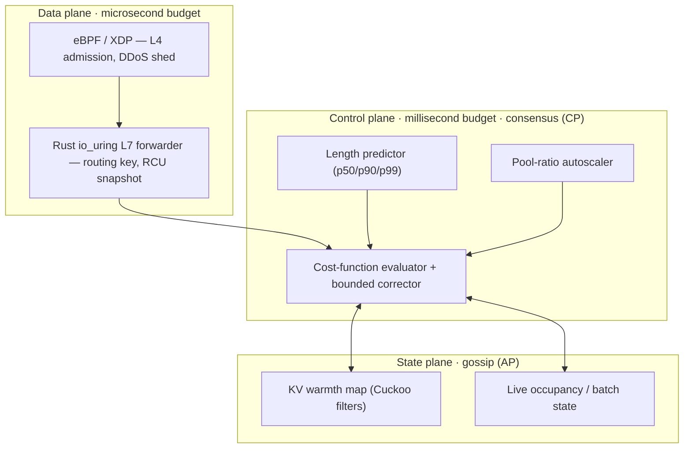

<div align="center">

# Demiurge

**A phase-aware, cache-locality-first load balancer for inference fleets.**

*Routes prefill and decode as independent phases across two pools, with the KV cache as the explicit hand-off artifact — because an inference request is a lease on stateful accelerator memory, not a packet.*

[](https://github.com/fxdv/demiurge/actions/workflows/design-conformance.yml)
[](https://github.com/fxdv/demiurge/actions/workflows/ci.yml)
[](https://github.com/fxdv/demiurge/actions/workflows/spec.yml)
[](#invariants-that-cant-rot)
[](#license)

</div>

> **The name.** In Platonic cosmology the *demiurge* is the craftsman who shapes
> formless chaos into an ordered cosmos — which is precisely this system's job:
> imposing locality-aware order on chaotic inference traffic.

---

## Table of contents

- [Why Demiurge](#why-demiurge)
- [The bet](#the-bet)
- [Architecture at a glance](#architecture-at-a-glance)
- [Repository layout](#repository-layout)
- [Quickstart](#quickstart)
- [Design-driven development](#design-driven-development)
  - [The single source of truth](#the-single-source-of-truth)
  - [Invariants that can't rot](#invariants-that-cant-rot)
  - [Traceability: spec ⇄ code ⇄ test](#traceability-spec--code--test)
- [Everyday workflows](#everyday-workflows)
- [Roadmap & gates](#roadmap--gates)
- [Contributing](#contributing)
- [License](#license)

---

## Why Demiurge

Round-robin and least-connections optimize for connection equivalence. For LLM
inference that's wrong on three counts, all at once:

- the most valuable backend state — the **KV cache** — is request-correlated, not interchangeable;
- the cost of a request depends on the target's **current batch and active KV footprint**, not a fixed weight;
- occupancy is a **random variable**, not a constant.

Demiurge is built to exploit exactly those three facts.

## The bet

> **Disaggregated prefill/decode-aware routing as the organizing principle of the entire balancer.**

Prefill is compute-bound, bursty, embarrassingly parallel, and cache-*producing*.
Decode is memory-bandwidth-bound, long-lived, latency-sensitive, and
cache-*consuming*. Demiurge schedules the two phases independently across two
pools and treats the KV cache as the explicit hand-off between them. Full
reasoning — alternatives rejected and what we deliberately sacrifice — lives in
[`spec/`](spec/).

## Architecture at a glance

Three planes, three consistency models, three blast radii:



- **Data plane** never blocks on the control plane; it serves the last RCU snapshot.
- **Control plane** holds the policy and republishes weights at a bounded cadence.
- **State plane** is eventually consistent on purpose — a wrong guess costs a cache miss, never a correctness violation. *Authorization* (who may share a cache line) is the one thing kept strongly consistent.

## Repository layout

| Path | What it is |
|------|------------|
| [`design/demiurge.params.toml`](design/demiurge.params.toml) | **Single source of truth** for every tunable constant. |
| [`design/requirements.toml`](design/requirements.toml) | Registry of normative/structural requirement IDs. |
| [`spec/`](spec/) | The LaTeX design spec + the `\req{}` macro. |
| `spec/generated/` | `@generated` parameter & conformance tables — never hand-edited. |
| [`crates/demiurge-cost/`](crates/demiurge-cost/) | The cost-function factor algebra and its property tests. |
| [`xtask/`](xtask/) | `gen` (regenerate artifacts) and `lint` (traceability) commands. |
| [`scripts/`](scripts/) | `bootstrap.sh`, `gate.sh`, `gen.sh` — local developer ergonomics. |

## Quickstart

```bash
./scripts/bootstrap.sh        # once: toolchain components + pre-push gate hook
cargo xtask gen               # regenerate everything derived from canonical inputs
cargo xtask lint              # enforce the spec ⇄ code ⇄ test join
cargo test --all              # run the executable invariants (C>0, ±α)
./scripts/gate.sh             # run the full local gate (mirrors CI)
```

If `cargo xtask gen` changes any tracked file, commit it — CI fails on stale
generated artifacts.

## Design-driven development

The spec isn't documentation that trails the code; it's the contract the code is
checked against. Three mechanisms keep them honest, all enforced in CI.

### The single source of truth

Every constant lives in **one** file:

```toml
# design/demiurge.params.toml
[corrector]
alpha = 0.20
```

`cargo xtask gen` projects it into both worlds:

- `crates/demiurge-cost/src/generated_params.rs` → the Rust constants the binary uses,
- `spec/generated/params_table.tex` → the table the spec prints.

Change `α` once, regenerate, and the prose and the binary move together.

### Invariants that can't rot

The cost function is a product of a strictly-positive time core and
strictly-positive factors, expressed as a **type algebra with no subtraction in
its API**:

```
Cost = TimeCore(>0) × BarrierFactor(≥1)* × Discount(0,1]* × Corrector[1−α, 1+α]
```

Nothing implements `Sub`/`Neg` and every field is private, so a future "just
subtract a reward term" *cannot compile*. The same properties are asserted three
ways:

| Layer | Mechanism | Guards against |
|-------|-----------|----------------|
| Compile | positive-factor newtypes | structurally illegal cost terms |
| CI | `proptest` (`[DEMI-COST-POS]`, `[DEMI-CORR-CLAMP]`) | regressions in composition |
| Prod | `FACTOR_CLAMP_EVENTS` metric / alarms | drift the first two miss |

### Traceability: spec ⇄ code ⇄ test

Every normative claim has a stable ID — `DEMI-COST-POS`, `DEMI-CORR-CLAMP`,
`DEMI-S1-DOMAIN`, … — appearing verbatim in all three places:

```text
spec:  \req{DEMI-COST-POS}            (prose, §4.5)
code:  /// [DEMI-COST-POS] ...        (doc-comment on the function)
test:  #[test] // [DEMI-COST-POS]     (the proof)
```

`cargo xtask lint` enforces: (1) every reference resolves to a declared
requirement; (2) every declared requirement is referenced in the spec or code;
(3) every `requires_test` requirement is referenced from a test.

## Everyday workflows

**Change a parameter**

```bash
$EDITOR design/demiurge.params.toml   # edit the one value
cargo xtask gen                       # propagate to code + spec
cargo test --all                      # confirm invariants still hold
git add -A && git commit              # spec + code move in lockstep
```

**Add a normative requirement** — add `\req{DEMI-NEW-THING}` in the spec, a row in
`requirements.toml`, and reference `[DEMI-NEW-THING]` in the function and its test;
`cargo xtask lint` must pass.

**Land a new module** — flip its requirement from `requires_test = false` to
`true` in the same PR. Conformance ratchets tighter as the system grows, never
looser.

## Roadmap & gates

- **Day 30 — Survival.** Two-pool split, RDMA hand-off, `Φ` barrier. *Gate:* no decode-pool OOM under a 10× prefill burst; transfer cost characterized.
- **Day 60 — Correctness.** Warmth map, analytic cost, transfer-aware pairing, pool-ratio controller; corrector off. *Gate:* `C>0` green in CI and shadow; pairing-regret p95 within budget.
- **Day 90 — Exit.** Data-plane snapshots, SLO flow control, tenant isolation, abortable migration, corrector in shadow. *Exit:* targets met with corrector off; corrector adds shadow gain without violating its clamp.

## Contributing

See [`CONTRIBUTING.md`](CONTRIBUTING.md). The short version: a behavior change and
its spec change land together, generated files are never hand-edited, and
`./scripts/gate.sh` must pass before you push.

## License

Dual-licensed under **Apache-2.0 OR MIT** — see [`LICENSE-APACHE`](LICENSE-APACHE)
and [`LICENSE-MIT`](LICENSE-MIT).

---

<div align="center">
<sub>Demiurge — design spec v1.4 · the spec is the contract, the code is the proof.</sub>
</div>
