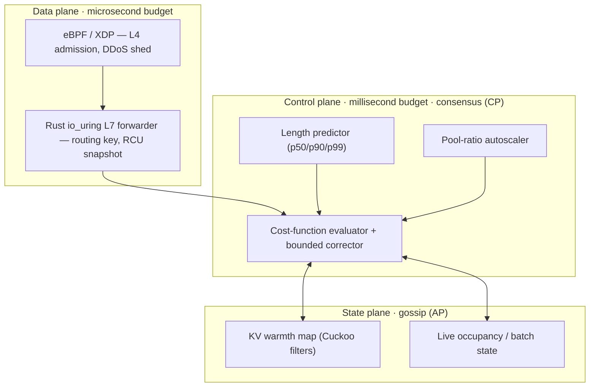

<div align="center">

# Demiurge

**A phase-aware, cache-locality-first load balancer for inference fleets**

[](https://github.com/fxdv/demiurge/actions/workflows/ci.yml)
[](https://github.com/fxdv/demiurge/actions/workflows/spec.yml)
[](spec/demiurge.tex)
[](#license)

</div>

> **The name.** In Platonic cosmology the *demiurge* is the craftsman who shapes
> formless chaos into an ordered cosmos — imposing locality-aware order on
> chaotic inference traffic.

> **Status.** [`ROADMAP.md`](ROADMAP.md) — tracks, burndown, and exit gates.

---

## Quickstart

**Daily loop**

```bash
./scripts/bootstrap.sh              # once: toolchain + pre-push hook (full gate)
cargo xtask lint                    # design loop — burndown + blur guard
./scripts/gate.sh --quick           # inner loop (~1 min): gen, lint, fmt, clippy, test
./scripts/gate.sh                   # before push / merge: full CI mirror
cargo xtask product-doc             # human brief PDF → target/product-doc/docs/
cargo xtask product-doc --plain     # same, no release stamp (needs pandoc)
cargo xtask spec                    # implementer's LaTeX spec → spec/demiurge.pdf
```

**Track B on macOS** (BPF compile + gate; XDP veth needs Linux):

```bash
./scripts/linux-vm/docker-track-b.sh bootstrap   # once
./scripts/linux-vm/docker-track-b.sh gate        # CI mirror inside container
```

Full VM path (XDP veth smoke): [`scripts/linux-vm/README.md`](scripts/linux-vm/README.md).

**Verify & release**

```bash
cargo xtask gen               # regenerate everything derived from canonical inputs
cargo run --release -q --package xtask -- bench-gate   # CPU hot-path gates
cargo run --release -q --package xtask -- bench-probe  # floor/p95 probe + thin-gate report
./scripts/load-bench.sh       # local TCP load + pseudo report (optional)
./scripts/load-stress.sh      # strict heavy stress — local only, not in gate.sh
./scripts/pre-release.sh      # gate + full load bench + stress (nightly / pre-tag)
./scripts/track-a-verify.sh   # optional Track A observability (~5 min; report.md)
./scripts/track-b-verify.sh   # Track B on Linux (gate + load + stress + report)
./scripts/publish.sh          # pre-release + tarball (binaries, one-pager, product PDF)
./scripts/publish.sh --github v0.1.0-p6   # local macOS/Linux + GitHub Release tag
cargo test --all              # executable invariants (C>0, ±α)
```

If `cargo xtask gen` changes any tracked file, commit it — CI fails on stale
generated artifacts.

---

## Why Demiurge

Round-robin and least-connections optimize for connection equivalence. For LLM
inference that's wrong on three counts:

- the most valuable backend state — the **KV cache** — is request-correlated, not interchangeable;
- the cost of a request depends on the target's **current batch and active KV footprint**, not a fixed weight;
- occupancy is a **random variable**, not a constant.

Demiurge is built to exploit exactly those three facts. Full design reasoning lives in [`spec/`](spec/).

---

## Architecture at a glance

Three planes, three consistency models, three blast radii:



- **Data plane** never blocks on the control plane; it serves the last RCU snapshot.
- **Control plane** holds the policy and republishes weights at a bounded cadence.
- **State plane** is eventually consistent on purpose — a wrong guess costs a cache miss, never a correctness violation.

---

## Repository layout

| Path | What it is |
|------|------------|
| [`design/demiurge.params.toml`](design/demiurge.params.toml) | **Single source of truth** for every tunable constant. |
| [`design/bench-gates.toml`](design/bench-gates.toml) | CPU hot-path gate thresholds (median ns/op, release). |
| [`design/load-bench.toml`](design/load-bench.toml) | Local TCP load scenarios + optional p99 soft gates. |
| [`design/requirements.toml`](design/requirements.toml) | Registry of normative/structural requirement IDs + phase tags. |
| [`ROADMAP.md`](ROADMAP.md) | Build plan — tracks, phased deliverables, gates, burndown. |
| [`docs/PRODUCT-AND-DESIGN.md`](docs/PRODUCT-AND-DESIGN.md) | Narrative product & design brief. |
| [`spec/demiurge.tex`](spec/) | Full target design; §1 lists shipped vs intended scope |
| `spec/generated/` | `@generated` parameter & conformance tables — never hand-edited. |
| [`crates/demiurge-cost/`](crates/demiurge-cost/) | Cost-factor algebra and property tests. |
| [`crates/demiurge-router/`](crates/demiurge-router/) | Phase-aware forwarder: async route, fast path, KV pool integration. |
| [`crates/demiurge-handoff/`](crates/demiurge-handoff/) | KV hand-off descriptor, registry, TCP transport (RDMA trait later). |
| [`crates/demiurge-control/`](crates/demiurge-control/) | Reservation ledger, TTL release, admit/reject metrics. |
| [`xtask/`](xtask/) | `gen`, `lint`, `spec`, `product-doc`, `bench-gate`, `load-bench`, `fleet-pilot`. |
| [`scripts/`](scripts/) | `bootstrap.sh`, `gate.sh`, `load-bench.sh`, `publish.sh`, `track-a-verify.sh`, `track-b-verify.sh`, [`linux-vm/`](scripts/linux-vm/). |

---

## Design contract

```text
design/demiurge.params.toml  ──►  cargo xtask gen  ──►  generated_params.rs + params_table.tex
design/requirements.toml     ──►  cargo xtask lint ──►  spec ⇄ code ⇄ test (requirement IDs)
spec/demiurge.tex            ──►  cargo xtask spec ──►  spec/demiurge.pdf
```

| Plate | Command | CI |
|-------|---------|-----|
| Single source of truth | `cargo xtask gen` | drift check in `gate.sh` |
| Traceability pipe | `cargo xtask lint` | ci quality job |
| Spec PDF | `cargo xtask spec` | spec workflow |
| CPU gates | `cargo xtask bench-gate` | ci workflow |

Cost is log-composed and positive by construction (`C>0`); property tests and bench gates enforce it. Details: [`spec/demiurge.tex`](spec/demiurge.tex) §4.

---

## Workflows

**Change a parameter**

```bash
$EDITOR design/demiurge.params.toml
cargo xtask gen && cargo test --all
```

**Add a requirement** — `\req{DEMI-NEW-THING}` in spec, row in `requirements.toml`, reference in code + test; `cargo xtask lint` must pass.

**Land a new module** — flip `requires_test` to `true` in the same PR. Conformance ratchets tighter, never looser.

---

## Roadmap

Phased deliverables, three tracks (macOS → Linux dataplane → fleet/GPU), exit gates, and live burndown: **[`ROADMAP.md`](ROADMAP.md)**.

Track progress: `cargo xtask lint` prints per-phase burndown (`P0: 4/4`, …).

---

## Contributing

See [`CONTRIBUTING.md`](CONTRIBUTING.md). External contributors sign [`CLA.md`](CLA.md) before merge.

---

## License

Dual-licensed under **Apache-2.0 OR MIT** — see [`LICENSE-APACHE`](LICENSE-APACHE)
and [`LICENSE-MIT`](LICENSE-MIT).
