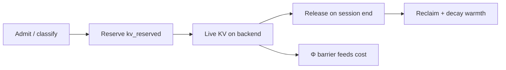

# Demiurge development roadmap

This document is the **concrete build plan** for turning the design spec
([`spec/demiurge.pdf`](spec/demiurge.pdf)) into running software: phased
deliverables, requirement IDs, exit gates, and explicit non-goals. Phases are
**dependency-ordered gates**, not calendar commitments.

**How progress is tracked**

| Mechanism | What it measures |
|-----------|------------------|
| [`design/requirements.toml`](design/requirements.toml) | Every normative claim has a `status` (`implemented` \| `intended`) and a `phase`. |
| `cargo xtask lint` | Traceability join + **phase burndown** (`phase N: implemented/total`). |
| `cargo xtask bench-gate` | Release-mode **CPU gates** vs `design/bench-gates.toml` (median ns/op). |
| `cargo xtask bench-probe` | Extended sampling (floor/median/p95), thin-gate flags, hot-path stack. |
| `spec/generated/conformance_matrix.tex` | Generated snapshot of requirement status (never hand-edited). |
| `./scripts/gate.sh` | Local mirror of CI; must pass before every merge. |

**Rules of the road**

1. **Ratchet only tighter.** A phase closes by flipping requirements from
   `intended` → `implemented` with named tests — never the reverse.
2. **Same-PR spec + code.** Behavior and `\req{ID}` move together
   ([`CONTRIBUTING.md`](CONTRIBUTING.md)).
3. **Honest scope.** Each phase lists what is *out* so we do not smuggle
   full-fleet features into an early gate.
4. **Hot paths stay fast.** CPU bench gates in `design/bench-gates.toml` are part
   of `./scripts/gate.sh` and CI; regressions fail the build.

---

## Burndown (today)

| Phase | Name | Requirements | Status |
|------:|------|--------------|--------|
| **0** | Foundations | 4 / 4 | **done** |
| **1** | Non-blocking routing loop | 2 / 2 | **done** |
| **2** | KV hand-off & memory barriers | 5 / 5 | **done** |
| **3** | State plane | 0 / 2 | planned |
| **4** | Control plane & pairing | 0 / 2 | planned |
| **5** | Data plane hardening | 0 / 2 | planned |
| **6** | Live migration | 0 / 1 | planned |
| **7** | Multi-tenancy & cache security | 0 / 1 | planned |
| **8** | Learned corrector graduation | 0 / 1 (`DEMI-CORR-GRAD`) | planned |

Run `cargo xtask lint` for the live burndown line.

---

## CPU bench gates

Hot-path code is gated on **median nanoseconds per operation** measured in
`--release`. Thresholds are canonical in
[`design/bench-gates.toml`](design/bench-gates.toml) — same design-driven pattern
as `demiurge.params.toml`. CI applies `settings.ci_slack` to absorb runner
jitter; local runs use the nominal limits.

```bash
cargo run --release -q --package xtask -- bench-gate   # or: ./scripts/gate.sh
cargo run --release -q --package xtask -- bench-probe  # tune limits / find thin gates
```

**Method.** Each gate warms up, times `bench_iters` iterations over `samples`
runs, and takes the **median** ns/op. Failure means the hot path regressed or a
change added work to the routing loop.

### Active CPU bench gates

Limits are canonical in [`design/bench-gates.toml`](design/bench-gates.toml);
CI applies `settings.ci_slack` (2×) for runner jitter. Run
`cargo xtask bench-probe` for floor/median/p95 when tuning.

| ID | Phase | What it measures | Limit (local median) |
|----|------:|------------------|----------------------|
| `BENCH-COMPOSE-8` | 0 | `compose()` — 4 barriers, 2 discounts, identity corrector | ≤ 50 ns/op |
| `BENCH-BACKEND-COST` | 0 | `Backend::cost()` — single target load signal | ≤ 8 ns/op |
| `BENCH-SELECT-64` | 0 | `select()` over 64 backends (cost recomputed each pick) | ≤ 1 µs/op |
| `BENCH-CLASSIFY` | 1 | HTTP head parse + fast-path / disaggregated classification | ≤ 350 ns/op |
| `BENCH-ROUTE-DISPATCH` | 1 | Disaggregated path — RequestId alloc + admission (no I/O) | ≤ 350 ns/op |
| `BENCH-KV-RESERVE` | 2 | `kv_breakdown()` + `phi_barrier_marginal()` hot path | ≤ 200 ns/op |

### Planned gates (register before closing the phase)

| Phase | Proposed ID | Target |
|------:|-------------|--------|
| **3** | `BENCH-WARM-LOOKUP` | Cuckoo warmth probe per routing key block |
| **4** | `BENCH-PAIR-GREEDY` | Greedy pf→dc pair selection over N×M candidates |
| **4** | `BENCH-REBALANCE` | Pool pressure normalization + π* computation |
| **5** | `BENCH-RCU-SNAPSHOT` | RCU table read on data-plane routing path |

Each new gate gets a row in `bench-gates.toml` in the **same PR** that lands the
code it measures. Tighten a limit only when deliberately optimizing that path;
loosening requires justification in the PR. Phase exit checklists below include
“bench gates pass” where applicable.

### Local load bench (optional)

End-to-end TCP load against a live router + mock backends. CI runs
`load-bench --ci` (scenarios with `ci = true`). Locally, `./scripts/load-bench.sh`
runs the full suite and renders the pseudo report.

```bash
./scripts/load-bench.sh
# step 1: cargo xtask load-bench   → target/load-bench/latest.json
# step 2: cargo xtask load-report  → pseudo box report on stdout + latest.pseudo

cargo run --release -q --package xtask -- load-bench --ci   # CI regression subset
```

Scenarios live in [`design/load-bench.toml`](design/load-bench.toml). Each can
declare an optional `max_p99_ms` soft gate (shown in the pseudo report; enforced
when running with `--ci` or `gate_strict = true`). The post-step report includes
throughput, latency percentiles, ASCII histograms, and gate pass/fail.

The full suite runs each scenario in an isolated subprocess (`--scenario`) so mock
backend threads do not accumulate across scenarios. Thin-place scouts (local only):

| ID | What it stresses |
|----|------------------|
| `LOAD-KV-BURST` | P2 KV ledger at ~10× fleet budget; long disagg + hand-off headers |
| `LOAD-LARGE-POOL` | `select()` over 64 backends (colocated short-context path) |
| `LOAD-CLASSIFY-MIX` | Mixed short/long token headers + KV hand-off on long requests |
| `LOAD-DISAGG-CHAIN` | Full disagg chain with backend I/O delay |

KV scenarios log hand-off transfer telemetry (bytes/wall p50/p99) — Phase 2 exit gate.

Debug one scenario: `cargo run --release -q --package xtask -- load-bench --scenario LOAD-KV-BURST`.

### Real stress (`./scripts/load-stress.sh`)

Strict local stress — zero errors and p99 gates enforced. Not in `gate.sh` or CI.
Each scenario runs in an isolated subprocess with 30s recovery between runs.

| ID | What it stresses |
|----|------------------|
| `LOAD-STRESS-REAL` | **THE REAL ONE**: 5k omni — mixed + KV + skew + 4096-token context |
| `LOAD-STRESS-KV-ARMY` | 4.8k mixed disagg + KV hand-off |
| `LOAD-STRESS-FLOOD` | 1.8k colocated flood (capped in-flight; runs last) |

```bash
./scripts/load-stress.sh
# → target/load-bench/stress.json + stress.pseudo
```

---

## Cross-cutting plans

Three mechanisms span multiple phases. Each has its own requirement IDs,
parameters, and exit gates; phases below reference when implementation lands.

### Short-context fast path

**Problem.** Disaggregated prefill→decode pays a fixed tax: two routing
decisions, a KV hand-off, and async coordination. For **short contexts** that
tax dominates the work — a 128-token prompt does not benefit from a cross-pool
transfer.

**Policy.** At admission, classify each request into one of two paths:

| Path | When | Behavior |
|------|------|----------|
| **Fast (colocated)** | Predicted prompt tokens ≤ `routing.short_context_tokens` *and* no warmth discount large enough to justify a targeted prefill hop | Route to a single backend that runs prefill+decode inline; **skip** cross-pool hand-off and async continuation. |
| **Disaggregated** | Long context, strong warmth hit on a specific prefill target, or fast-path pool saturated | Full `Route` → async prefill → `OnPrefillComplete` → decode pick. |

**Classification inputs** (in priority order):

1. Declared / measured prompt token count from the request.
2. Length predictor p50 when count is unknown (hedge with p90 if near threshold).
3. Warmth map hit that exceeds `routing.short_context_warmth_override` — forces disaggregated even for short prompts when colocation would miss cache.

**Cost interaction.** Fast-path targets use a **colocated score**:

```text
ln C_fast = ln(T_prefill+decode) + ln(queue_barrier) + ln(corrector)
```

Disaggregated targets keep the existing two-phase score. The router compares
**comparable** totals — never a fast-path target against only half of a
disaggregated path.

**Implementation phases**

| Phase | Work |
|-------|------|
| **1** | Admission classifier + fast-path branch in `demiurge-router`; mock backends that accept colocated mode. |
| **3** | Warmth override: short prompt + hot prefix on backend B → disaggregated to B's prefill pool anyway. |
| **4** | Predictor-driven classification; fast-path share telemetry (`fast_path_ratio`, mis-route regret). |

**Proposed requirement** — registered as `intended` in `requirements.toml`:

| ID | Summary | Proposed test |
|----|---------|---------------|
| `DEMI-SHORT-FASTPATH` | Short contexts skip cross-pool hand-off unless warmth override fires. | `short_context_uses_colocated_path` |

**Exit gate**

- [ ] Synthetic mix: fast-path requests never allocate a cross-pool hand-off handle.
- [ ] At equal load, fast-path p50 latency below disaggregated baseline for ≤ threshold prompts.
- [ ] Warmth override correctly forces disaggregated routing when colocation would miss.

**Parameters** — canonical in `design/demiurge.params.toml` (`[routing].*`); consumed by `route()` / fast-path classification.

---

### KV cache overhead accounting

**Problem.** Routing and memory barriers must reason about **real** KV footprint,
not idealized `tokens × bytes`. Ignoring overhead OOMs the decode pool silently;
over-counting wastes capacity.

**Model.** Per-request KV reservation uses block-aligned accounting:

```text
kv_tokens     = ceil(prompt_tokens / block_tokens) × block_tokens
kv_payload    = kv_tokens × bytes_per_token(model)
kv_metadata   = kv_payload × metadata_overhead_fraction
kv_fragment   = kv_payload × fragmentation_slack(model, batch_size)
kv_reserved   = kv_payload + kv_metadata + kv_fragment
```

| Term | Source |
|------|--------|
| `block_tokens` | `design/demiurge.params.toml` → `[cache].block_tokens` |
| `bytes_per_token` | Model card / runtime probe (published into RCU snapshot) |
| `metadata_overhead_fraction` | `[kv].metadata_overhead_fraction` — page tables, handles, refcounts |
| `fragmentation_slack` | `[kv].fragmentation_slack` — allocator bucket rounding |

**Fleet-level reservation (not per-request sum).** The Φ barrier and admission
decisions use the **aggregate** occupancy distribution:

- Track live `kv_bytes` per decode backend (gossip, Phase 3).
- Reserve new admits against `F⁻¹_p90(Δkv | fleet)` — the incremental bytes the
  *fleet* needs at the 90th percentile, not `N × p90_per_request` (which
  over-provisions).
- `[DEMI-BARRIER-PHI]` (Phase 2) encodes this distinction.

**Overhead lifecycle**



| Stage | Owner | Notes |
|-------|-------|-------|
| Reserve | Control plane | At decode placement; holds until session end or migration completes. |
| Live | State plane | Gossip cadence; stale reads fail toward **expensive**, not cheap. |
| Release | Data plane | On connection close, migration abort, or TTL expiry for abandoned sessions. |
| Reclaim | Backend + CP | `[kv].abandoned_session_ttl` frees orphaned reservations. |

**Telemetry** (Phase 2 — shipped):

- `kv_bytes_live`, `kv_bytes_reserved`, `kv_overhead_ratio` per backend and pool.
- `kv_admit_rejects_total` — admissions denied by Φ barrier.
- `kv_reservation_error` — reserved vs live drift (should stay bounded).

**Implementation phases**

| Phase | Work |
|-------|------|
| **2** | Reservation struct + Φ barrier wired to aggregate distribution; bench proves no OOM under burst. |
| **3** | Live KV gossip; reservation drift metrics. |
| **4** | Predictor feeds `kv_tokens`; model `bytes_per_token` in RCU snapshot. |
| **6** | Migration moves `kv_reserved` atomically; abort releases reservation on source. |

**Requirements (implemented in `requirements.toml`)**

| ID | Summary |
|----|---------|
| `DEMI-KV-HANDOFF` | Decode placement never proceeds without a valid KV hand-off handle. |
| `DEMI-KV-OVERHEAD` | Reservation includes metadata + fragmentation terms, not raw token bytes alone. |
| `DEMI-BARRIER-PHI` | Fleet aggregate reservation; never sum per-request p90 headroom. |
| `DEMI-KV-RELEASE` | Session end, abort, or TTL always releases reservation. |
| `DEMI-KV-TRANSFER-TELEM` | Hand-off transfer cost logged as p50/p99 bytes and wall time. |

**Exit gate (met in Phase 2)**

- [x] Reservation formula unit-tested against known model configs.
- [x] 10× prefill burst bench: decode pool stays under memory budget with overhead terms enabled.
- [x] Hand-off transfer telemetry (bytes/wall p50/p99) in load scenarios.
- [x] `kv_admit_rejects_total` and reservation metrics bounded under steady load.

**Parameters** (canonical in `design/demiurge.params.toml`):

```toml
[kv]
metadata_overhead_fraction = 0.08
fragmentation_slack = 0.05
abandoned_session_ttl_s = 300
```

---

### Dynamic pool rebalancing

**Problem.** Prefill and decode load are not symmetric: burstiness, average
context length, and cache hit rate shift the optimal **capacity split** between
pools continuously. Static pool sizes leave one pool starved while the other idles.

**Scope.** Rebalancing adjusts **routing weights and autoscaler targets** for
each pool — not individual request placement. Request placement stays
min-cost within the pool the policy selects.

**Signals** (each normalized to `[0, 1]` pressure):

| Signal | Pool | Meaning |
|--------|------|---------|
| `Q_prefill` | prefill | Queue depth / capacity |
| `Q_decode` | decode | Queue depth / capacity |
| `KV_decode` | decode | `kv_bytes_live / kv_bytes_capacity` |
| `SLO_prefill` | prefill | ITL / TTFT breach fraction |
| `SLO_decode` | decode | ITL breach fraction |
| `FP_share` | both | Fraction of traffic on short-context fast path (reduces prefill pool demand) |

**Control law.** Target prefill share `π*` (fraction of fleet capacity assigned
to prefill):

```text
demand_prefill = w_q·Q_prefill + w_s·SLO_prefill · (1 − FP_share)
demand_decode  = w_q·Q_decode  + w_kv·KV_decode + w_s·SLO_decode
π*             = demand_prefill / (demand_prefill + demand_decode)
```

Apply with **hysteresis** and **cooldown** so weights do not flip-flop:

```text
if |π* − π| > rebalance_hysteresis:
    if cooldown_elapsed:
        π ← π*
        publish to RCU snapshot + autoscaler
        reset cooldown
```

`π` feeds:

1. **Pool-ratio autoscaler** — scale prefill vs decode node counts (or GPU fractions).
2. **Routing bias** — optional soft penalty on the overloaded pool's cost factors
   until capacity catches up (never hard reject unless Φ barrier fires).

**Operating modes**

| Mode | Behavior |
|------|----------|
| **Shadow** | Compute `π*` and log counterfactual; no actuation. Default until Phase 4 exit. |
| **Can actuate** | Publish `π` to autoscaler; routing bias enabled. |
| **Frozen** | Manual override; rebalancer observes only. |

**Implementation phases**

| Phase | Work |
|-------|------|
| **3** | Export normalized pressure signals from state plane gossip. |
| **4** | `demiurge-control`: rebalancer loop, shadow mode, `[DEMI-POOL-RATIO]`. |
| **5** | Autoscaler webhook / RCU publish path; actuation behind feature flag. |

**Proposed requirement**

| ID | Summary | Proposed test |
|----|---------|---------------|
| `DEMI-POOL-RATIO` | Rebalancer moves `π` only when hysteresis exceeded and cooldown elapsed; shadow mode never actuates. | `rebalance_respects_hysteresis_and_cooldown` |

**Exit gate**

- [ ] Shadow replay on production trace: `π*` correlates with known prefill-heavy windows.
- [ ] Step-load test: actuation removes sustained queue imbalance without oscillation.
- [ ] Fast-path traffic spike reduces `demand_prefill` via `FP_share` term (no manual retune).

**Parameters** (to add when Phase 4 starts):

```toml
[pool]
rebalance_hysteresis = 0.10
rebalance_cooldown_s = 300
weight_queue = 0.35
weight_kv = 0.30
weight_slo = 0.35
```

---

## Phase 0 — Foundations ✅ (shipped)

**Goal.** Prove the design-driven toolchain and ship the smallest honest router:
cost algebra + least-cost selection over phase pools.

**Deliverables**

| Artifact | Role |
|----------|------|
| `crates/demiurge-cost/` | Log-space cost composition; fail-expensive clamping. |
| `crates/demiurge-router/` | Phase pools, `select()` / `Router::pick()`, blocking TCP proxy shell. |
| `xtask gen` / `xtask lint` | Parameter projection + traceability + phase burndown. |
| CI (`design-conformance`, `ci`, `spec`) | Drift detection, fmt/clippy/test, PDF build. |

**Requirements (implemented + test-backed)**

| ID | Summary | Tests |
|----|---------|-------|
| `DEMI-COST-POS` | Cost strictly positive by construction (log-space). | `cost_strictly_positive`, `cost_log_is_finite_at_extremes` |
| `DEMI-CORR-CLAMP` | Corrector bounded to `[1−α, 1+α]`. | `corrector_multiplier_bounded` |
| `DEMI-FAIL-EXPENSIVE` | Invalid signals saturate toward expensive. | `invalid_signal_never_cheapens` |
| `DEMI-ROUTE-MINCOST` | Minimum-cost backend in a pool. | `selects_min_cost_backend` |

**Exit gate (met).** `./scripts/gate.sh` green; 4/4 phase-0 requirements
`implemented`; `demiurge-router` integration test proxies to the cheaper backend;
Phase 0 CPU bench gates pass (`BENCH-COMPOSE-8`, `BENCH-BACKEND-COST`,
`BENCH-SELECT-64`).

**Explicitly not in Phase 0.** XDP, RDMA, gossip, warmth map, async prefill,
migration, cross-tenant sharing, learned corrector in production, short-context
fast path, KV overhead accounting, pool rebalancing.

---

## Phase 1 — Non-blocking routing loop ✅ (shipped)

**Goal.** Replace the synchronous proxy with the spec’s `Route` shape: admit,
dispatch prefill **asynchronously**, return immediately; decode placement is a
continuation on fresh telemetry (`OnPrefillComplete`). Land the **short-context
fast path** classifier (colocated branch only; warmth override waits for Phase 3).

**Deliverables**

| Crate / module | Work |
|----------------|------|
| `demiurge-router` | Split `route()` / `on_prefill_complete()`; request correlation handle; decode pool pick uses post-prefill signals (length actuals, KV footprint estimate). |
| `demiurge-router` | Non-blocking accept path: dispatch prefill to backend without holding the client connection on prefill completion. |
| `demiurge-router` | Short-context fast path: colocated routing when `prompt_tokens ≤ short_context_tokens`. |
| Tests | Harness with mock prefill backend that signals completion; assert forwarder thread is not blocked for prefill duration. |
| Spec | `\req{ALG-ROUTE}`, `\req{DEMI-SHORT-FASTPATH}`. |

**Requirements to close**

| ID | Kind | Proposed test |
|----|------|---------------|
| `ALG-ROUTE` | structural | `route_returns_before_prefill_complete` |
| `DEMI-SHORT-FASTPATH` | normative | `short_context_uses_colocated_path` |

**Exit gate**

- [x] `ALG-ROUTE` and `DEMI-SHORT-FASTPATH` → `implemented` with named tests.
- [ ] Under synthetic load, accept latency p99 does not track prefill duration.
- [x] Decode placement runs only after prefill completion event (disaggregated path).
- [x] Short prompts never allocate a cross-pool hand-off handle.
- [x] `BENCH-CLASSIFY` and `BENCH-ROUTE-DISPATCH` gates pass.

**Out of scope.** RDMA KV transfer, warmth override, KV overhead terms, XDP shedding, migration.

---

## Phase 2 — KV hand-off & memory barriers ✅ (shipped)

**Goal.** Make the KV cache the explicit prefill→decode artifact; implement **KV
overhead accounting** and the **Φ memory-pressure barrier** so a prefill burst
cannot OOM the decode pool.

**Deliverables**

| Crate / module | Work |
|----------------|------|
| `demiurge-handoff` (new) | Hand-off descriptor: `(request_id, kv_handle, byte_len, source_backend)`; pluggable transport (TCP blob channel first; RDMA trait behind feature flag). |
| `demiurge-cost` | Wire `BarrierFactor` from aggregate decode-pool KV headroom using overhead-aware `kv_reserved`. |
| `demiurge-router` | Prefill completion publishes hand-off; decode pick waits on handle availability. |
| `demiurge-control` | Reservation ledger: admit, release, TTL reclaim (`DEMI-KV-RELEASE`). |
| Bench | `benches/handoff_burst.rs` — 10× prefill burst against fixed decode pool memory budget. |
| Load | `./scripts/load-stress.sh` — 11.6k strict local stress (REAL + KV army + flood). |

**Requirements to register**

| ID | Summary |
|----|---------|
| `DEMI-KV-HANDOFF` | Decode placement never proceeds without a valid KV hand-off handle. |
| `DEMI-KV-OVERHEAD` | Reservation includes metadata + fragmentation, not raw token bytes. |
| `DEMI-BARRIER-PHI` | Fleet aggregate reservation; not per-request p90 sum. |
| `DEMI-KV-RELEASE` | Session end, abort, or TTL releases reservation. |
| `DEMI-KV-TRANSFER-TELEM` | Hand-off transfer cost logged as p50/p99 bytes and wall time. |

**Exit gate**

- [x] No decode-pool OOM in the 10× prefill burst bench with overhead terms enabled.
- [x] Hand-off transfer cost logged: p50 / p99 bytes and wall time.
- [x] Φ barrier visible in cost: overloaded decode pool raises all decode targets’ log-cost monotonically.
- [x] `kv_reservation_error` metric present and bounded in steady-state bench.
- [x] `BENCH-KV-RESERVE` gate passes.

**Out of scope.** Cross-node RDMA production path (TCP proof first), warmth map,
tenant isolation, pool rebalancing actuation.

---

## Phase 3 — State plane (warmth + occupancy)

**Goal.** Eventually-consistent backend state feeds routing discounts; a wrong
guess costs a cache miss, never a correctness violation. Enable **warmth
override** on the short-context fast path.

**Deliverables**

| Crate / module | Work |
|----------------|------|
| `demiurge-state` (new) | KV warmth map (Cuckoo filters per backend; params `block_tokens`, `cuckoo_max_loadfactor`). |
| `demiurge-state` | Live occupancy / batch-size gossip (`gossip_interval_ms`, `frame_rate_hz`). |
| `demiurge-state` | Live `kv_bytes` gossip for overhead / Φ barrier inputs. |
| `demiurge-cost` | Warmth hits as `Discount` factors; stale entries fail toward neutral (1.0), not cheap. |
| `demiurge-router` | Warmth override on fast path; subscribe to RCU-published state snapshot. |
| `demiurge-control` | Export normalized pool pressure signals for rebalancer (shadow inputs only). |

**Requirements to register**

| ID | Summary |
|----|---------|
| `DEMI-WARM-DISCOUNT` | Warmth hit applies a bounded discount; miss applies none. |
| `DEMI-STATE-AP` | State plane is AP; routing tolerates stale warmth (miss, not crash). |

**Exit gate**

- [ ] Synthetic trace replay: warmth-aware routing improves cache-hit ratio vs phase-1 baseline at equal load.
- [ ] Injected stale warmth → miss only; no panic, no auth side effects.
- [ ] Gossip partition heals without control-plane involvement.
- [ ] Short prompt + strong warmth on remote backend → disaggregated path (override).
- [ ] `BENCH-WARM-LOOKUP` gate passes.

**Out of scope.** Strongly-consistent authorization (Phase 7), corrector training, rebalancer actuation.

---

## Phase 4 — Control plane & pairing

**Goal.** Full analytic cost on the control plane; **greedy pf→dc pairing**
(documented approximation); **dynamic pool rebalancing** (shadow → can actuate);
pairing-regret monitor.

**Deliverables**

| Crate / module | Work |
|----------------|------|
| `demiurge-control` (new) | `SelectPrefillTarget` then `SelectDecodeTarget` (greedy joint objective from spec §8). |
| `demiurge-control` | Length predictor exposing p50 / p90 / p99; reserve against **aggregate** distribution. |
| `demiurge-control` | Pool rebalancer: compute `π*`, hysteresis + cooldown, shadow mode default. |
| `demiurge-control` | Model `bytes_per_token` in RCU snapshot for KV overhead formula. |
| Telemetry | Pairing-regret monitor: `C(greedy) − C(oracle)` on sampled decisions in shadow. |
| `demiurge-cost` | Transfer-cost term inside decode score (pf→dc distance / bandwidth). |

**Requirements to register**

| ID | Summary |
|----|---------|
| `DEMI-PAIR-GREEDY` | Prefill target fixed first; decode optimized conditional on pf (documented approx). |
| `DEMI-POOL-RATIO` | Rebalancer adjusts `π` with hysteresis; shadow mode never actuates. |

**Exit gate**

- [ ] `DEMI-COST-POS` / `DEMI-CORR-CLAMP` still green under full compose path.
- [ ] Pairing-regret p95 within budget on shadow trace (budget in params file).
- [ ] **Corrector OFF** in production path; identity corrector only.
- [ ] Rebalancer shadow replay: `π*` tracks prefill-heavy windows on production trace.
- [ ] Step-load test: no pool-weight oscillation (hysteresis holds).
- [ ] `BENCH-PAIR-GREEDY` and `BENCH-REBALANCE` gates pass.

**Out of scope.** Learned corrector in prod (Phase 8), XDP (Phase 5), autoscaler actuation (Phase 5).

---

## Phase 5 — Data plane hardening

**Goal.** Microsecond data plane: XDP admission, `io_uring` L7 forwarder, RCU
snapshots — control plane never blocks the hot path. Enable **rebalancer
actuation** behind a feature flag.

**Deliverables**

| Crate / module | Work |
|----------------|------|
| `demiurge-dataplane` (new) | eBPF/XDP program: tenant token bucket + DDoS shed (`free_block_interrupt_pct`). |
| `demiurge-dataplane` | Rust `io_uring` L7 forwarder; reads routing table via RCU snapshot only. |
| `demiurge-control` | Publishes snapshot at bounded cadence; autoscaler webhook for `π`. |
| Tests | Fault injection: CP stall must not increase data-plane p99 admit latency. |

**Requirements to register**

| ID | Summary |
|----|---------|
| `DEMI-DP-RCU` | Data plane serves last published RCU snapshot; never blocks on CP. |
| `DEMI-XDP-SHED` | XDP sheds before L7 on bucket exhaustion. |

**Exit gate**

- [ ] Data-plane p99 admit latency within budget under CP slowdown injection.
- [ ] RCU snapshot age bounded (staleness metric + alert).
- [ ] SLO flow control: shed at XDP before decode pool saturation.
- [ ] Rebalancer actuation removes sustained pool skew in step-load test (feature flag on).
- [ ] `BENCH-RCU-SNAPSHOT` gate passes.

**Out of scope.** Live migration (Phase 6), cross-tenant auth (Phase 7).

---

## Phase 6 — Live migration

**Goal.** Abortable, chunked decode migration; cutover commits only if estimated
stall ≤ ε × ITL budget. Migration moves **KV reservations** atomically.

**Requirement to close**

| ID | Summary | Proposed test |
|----|---------|---------------|
| `DEMI-MIG-SUBITL` | Cutover aborts when `est > ε · ITL`. | `migration_aborts_when_over_budget` |

**Deliverables**

| Crate / module | Work |
|----------------|------|
| `demiurge-router` or `demiurge-control` | `MigrateOrLink`: chunked KV move + `QuiesceOneStep` loop. |
| `demiurge-control` | Transfer `kv_reserved` on successful cutover; release on abort. |
| Telemetry | `RecordMigrationStall` — measured vs estimated stall histogram. |
| Params | `migration.itl_budget_fraction_eps` (already in `demiurge.params.toml`). |

**Exit gate**

- [ ] `DEMI-MIG-SUBITL` → `implemented` with property/integration tests.
- [ ] Measured migration stall p99 ≤ budget on benchmark fleet.
- [ ] Abort path leaves original placement untouched (no double-free / duplicate decode).
- [ ] Reservation ledger consistent after abort and after successful cutover.

**Risk (explicit).** Sub-ITL cutover assumes `QuiesceOneStep` + atomic attachment
swap is genuinely sub-ITL on target hardware — **must be measured**, not assumed.
If p99 cutover exceeds ITL on reference hardware, migration stays shadow-only.

**Out of scope.** Cross-tenant migration (Phase 7 auth must approve targets).

---

## Phase 7 — Multi-tenancy & cache security (S1)

**Goal.** Opt-in prefix-cache sharing with **strongly-consistent authorization**;
AP warmth, CP membership.

**Requirement to close**

| ID | Summary | Proposed test |
|----|---------|---------------|
| `DEMI-S1-DOMAIN` | Non-member never obtains a shared cache-domain key. | `non_member_never_resolves_shared_key` |

**Deliverables**

| Crate / module | Work |
|----------------|------|
| `demiurge-auth` (new) | Shared-Prefix Group registry; CP consensus path for membership. |
| `demiurge-auth` | `RegisterTemplate` / `MatchTemplate` with content verification. |
| `demiurge-state` | Cache-domain keys = tenant-salted fingerprint; membership check before discount. |
| Fuzz | Random tenant/group queries; assert isolation. |

**Exit gate**

- [ ] `DEMI-S1-DOMAIN` → `implemented` with fuzz + integration tests.
- [ ] Stale “warm” state → miss; stale “authorized share” impossible (CP blocks).
- [ ] Template mismatch → no shared domain key even for group co-members.

**Out of scope.** Billing, quota enforcement beyond token bucket.

---

## Phase 8 — Learned corrector graduation

**Goal.** Shadow → canary → production corrector without violating
`DEMI-CORR-CLAMP` or `DEMI-COST-POS`. **Only after Phase 4 exit with corrector
OFF.**

**Deliverables**

| Work | Detail |
|------|--------|
| Shadow pipeline | Log `(features, analytic_cost, observed_latency)`; train bounded δ. |
| Canary | Corrector on for tenant subset; `FACTOR_CLAMP_EVENTS` + clamp-rate alert. |
| Production gate | Corrector adds measurable goodput **without** clamp saturation or C>0 violations. |

**Exit gate**

- [ ] All Phase 0–7 gates met with **corrector identity** in production.
- [ ] Shadow corrector shows net positive goodput on held-out trace.
- [ ] Canary: clamp event rate below threshold; no `DEMI-CORR-CLAMP` test failures.
- [ ] `DEMI-CORR-GRAD` → `implemented` after shadow/canary gates met.
- [ ] Tripwire: any future cost term reintroducing subtraction fails code review +
      `DEMI-COST-POS` proptest (spec §4.3).

---

## Registering a new requirement

When a phase starts, **before** merging behavior:

1. Add `[[requirement]]` to `design/requirements.toml` with `status = "intended"`,
   correct `phase`, and `requires_test = false`.
2. Add `\req{ID}` to `spec/demiurge.tex`.
3. Run `cargo xtask gen && cargo xtask lint`.
4. Implement + tests; flip to `implemented`, set `requires_test = true`, list
   `tests = ["fn_name", ...]`.
5. `./scripts/gate.sh` green; update this roadmap’s burndown table if needed.

---

## Related documents

| Document | Role |
|----------|------|
| [`spec/demiurge.tex`](spec/demiurge.tex) | Target design (steady-state truth). |
| [`design/demiurge.params.toml`](design/demiurge.params.toml) | Tunable constants (single source). |
| [`design/requirements.toml`](design/requirements.toml) | Requirement registry + phase tags. |
| [`README.md`](README.md) | Project overview + quickstart. |
